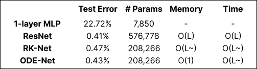
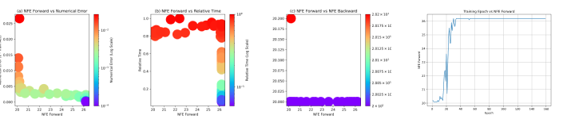
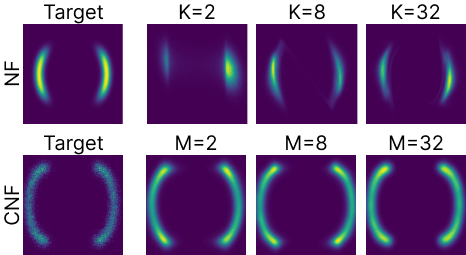
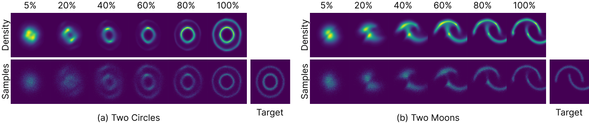
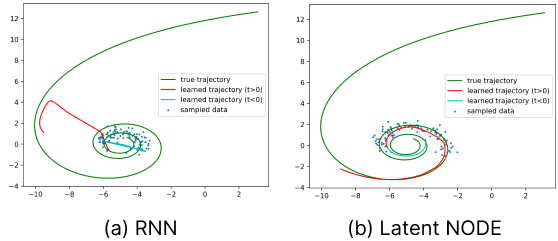

# Overview
This repository contains scripts for experiments involving Neural Ordinary Differential Equations (Neural ODEs), based on the implementation from torchdiffeq. These experiments were conducted as part of the AI60301 Paper Presentation to explore various applications of continuous-depth models, including MNIST classification and normalizing flows.

To install the necessary dependencies:
```
pip install torchdiffeq
```

## Tab1: ODEnet for MNIST
The `tab1_odenet_mnist.py` script reproduces the MNIST experiments from the Neural ODE paper. Although both the architecture and ODE solver differ slightly from the original setup, the experimental results remain consistent with those reported in the paper.

This experiment uses an adaptive ODE solver to approximate a continuous-depth network while supporting backpropagation through the network.
```
python odenet_mnist.py --network odenet
```

<p align="center">

</p>
This figure shows the test accuracy, training time, and the number of function evaluations (NFE) required by the ODE solver during training. These results demonstrate how well ODE-Net balances computational efficiency and accuracy.

## Fig3: Statistics of a trained ODE-Net
This section visualizes the statistics collected during the `tab1_odenet_mnist.py` experiment such as the Number of Function Evaluations (NFE), numerical error, and relative time.

Below is the code used to generate these visualizations.
```
python fig3.py
```
<p align="center">

</p>
This figure shows an example of the results.

## Fig4: Comparison of NF vs. CNF
This section compares normalizing flows (NF) with continuous normalizing flows (CNF).

The NF model applies a series of non-linear transformations to the input data to match the target distribution.
```
python fig4_nf.py
```
CNF leverages continuous transformations, minimizing the Kullback-Leibler Divergence between the transformed distribution and the target distribution.
```
python fig4_cnf.py
```
<p align="center">

</p>
The visualization illustrates the difference between NF and CNF in capturing complex data distributions. CNF provides smoother transformations, which are more suitable for modeling complex dynamics.

## Fig5: Visualizing the transformation from noise to data
This experiment visualizes the continuous transformation of a simple Gaussian distribution into structured datasets (circles or moons) using a CNF. It demonstrates how the CNF learns to match target distributions over time.
```
python fig5_cnf.py
```
<p align="center">

</p>
The figure above shows the step-by-step transformation of the CNF. As time progresses, the CNF evolves the samples from a noisy initial state into structured target distributions.

## Fig8: Comparison of NF vs. CNF
This section demonstrates two approaches for modeling 2D spiral trajectories.

Latent ODEs use a latent representation and ODE dynamics to learn from noisy trajectory samples.
```
python fig8_latent_ode.py
```
The RNN models the trajectory dynamics by predicting the next step in the sequence from noisy samples.
```
python fig8_rnn.py
```
<p align="center">

</p>

This figure compares the learned trajectories from the Latent ODE and RNN models with the true trajectory. Both models aim to reconstruct the trajectory from noisy samples, but the Latent ODE captures continuous dynamics, while the RNN focuses on discrete step predictions.

